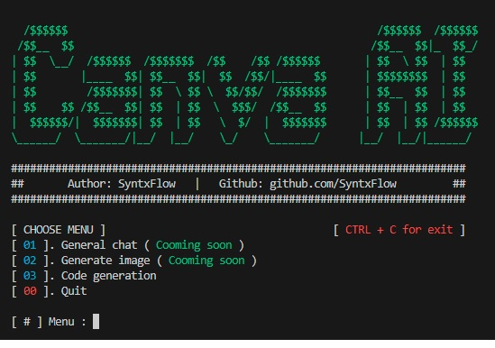

# CanvaAI 🖼️✨

[](https://badge.fury.io/py/canvaai)
[](https://pypi.org/project/canvaai/)
[](https://www.gnu.org/licenses/gpl-3.0)

</br>
</br>



</br>

**CanvaAI** is an open-source Python project providing tools to interact with Canva's AI features by making requests to its underlying API. It essentially acts as a scraper, offering both an interactive Terminal User Interface (TUI) and a Python library for programmatic access.

> [!IMPORTANT]
> **This repository is still in its early stages and will continue to be developed with more features. If you would like to contribute, please see the contribution guidelines [here](#-contributing).**
>
> There are still unknown bugs :)

This project is intended for educational and research purposes.

## 📜 Table of Contents

- [CanvaAI 🖼️✨](#canvaai-️)
  - [📜 Table of Contents](#-table-of-contents)
  - [⚠️ Important Notice \& Disclaimer](#️-important-notice--disclaimer)
  - [✨ Features](#-features)
    - [Under development](#under-development)
  - [🚀 Getting Started](#-getting-started)
    - [Prerequisites](#prerequisites)
    - [Installation](#installation)
  - [💻 Usage](#-usage)
    - [Interactive Terminal User Interface (TUI)](#interactive-terminal-user-interface-tui)
  - [🤝 Contributing](#-contributing)
  - [📝 License](#-license)

## ⚠️ Important Notice & Disclaimer

By using this software, you agree to the following terms:

*   This project is for **educational and research purposes only**.
*   The developers and maintainers of CanvaAI are **not responsible** for any misuse, damage, or consequences arising from the use of this software.
*   You are solely responsible for complying with Canva's Terms of Service and any applicable local, state, national, and international laws and regulations.
*   **Automated access to services like Canva, especially through unofficial means (scraping), can be a violation of their Terms of Service and may lead to account restrictions or other penalties.**
*   **USE AT YOUR OWN RISK.** The authors assume no liability for any actions taken by users of this software.
*   This project is **not affiliated with, endorsed by, or sponsored by Canva** in any way. All trademarks, service marks, trade names, trade dress, product names and logos appearing on the site are the property of their respective owners.

## ✨ Features

*   Interact with Canva AI functionalities (e.g., text-to-image generation, general chat, and code generating).
*   **Interactive Terminal User Interface (TUI)** for a rich console-based experience.
*   Python library for seamless integration into your own Python projects.
*   Requires user-provided cookies for authentication with Canva.

### Under development
- [ ] As a python library
- [ ] Canva ai image generator
- [ ] Canva general chat
- [ ] Cookies files with the format

## 🚀 Getting Started

Follow these instructions to get CanvaAI up and running on your system.

### Prerequisites

*   Python 3.7+
*   pip (Python package installer)
*   Valid Canva cookies (you'll need to extract these from your browser after logging into Canva)

### Installation

<!-- You can install CanvaAI directly from PyPI:

```bash
pip install canvaai
``` -->

<!-- Alternatively, for the latest development version, you can clone this repository and install it locally: -->

```bash
pipx install poetry
```

```bash
git clone https://github.com/SyntxFlow/canvaAI.git
cd canvaAI
poetry install
poetry build
```

## 💻 Usage

CanvaAI can be used either via its interactive Terminal User Interface (TUI) or as a Python library in your own scripts.

### Interactive Terminal User Interface (TUI)

CanvaAI offers an interactive Terminal User Interface (TUI) for a more user-friendly experience directly in your terminal. This mode provides a visual, menu-driven, or prompt-based way to interact with Canva AI features without leaving your console.

You will need a `cookies.txt` file containing your Canva authentication cookies.

```bash
python -m canvaai --cookies cookies.txt
```

> [!NOTE]
> The `--cookies cookies.txt` argument is shown as an example for passing the cookies file. Your TUI might have other ways to load cookies or other initial configuration flags.</br></br>
> Your `cookies.txt` file should be in a format that your script can parse (e.g., Netscape cookie file format or a simple key=value per line).

> [!IMPORTANT]
> **The cookies.txt file must be in netscape format!**
> 
> Get it via chrome extension [Get cookies.txt LOCALLY](https://chromewebstore.google.com/detail/get-cookiestxt-locally/cclelndahbckbenkjhflpdbgdldlbecc)

<!-- ### As a Python Library

You can integrate CanvaAI's functionalities into your Python applications.

First, install the library if you haven't already:

```bash
pip install canvaai
```

Then, you can use it in your Python code:

```python
from canvaai.client import Client

# Path to your cookies file or the cookie string itself
# Netscape format
COOKIES_FILE_PATH = "cookies.txt"

try:
    # Initialize the client
    client = Client(cookies=COOKIES_FILE_PATH)

    # Example: Generate an image
    prompt = "Create a modern website with dark mode and responsive features"
    code_data = client.code_generator(
        prompt=prompt,
    )

    if code_data:
        with open("generated_canva_image.png", "wb") as f:
            f.write(code_data)
        print(f"Image successfully generated and saved to generated_canva_image.png")
    else:
        print("Failed to generate image.")

except FileNotFoundError:
    print(f"Error: Cookies file not found at {COOKIES_FILE_PATH}")
except Exception as e:
    print(f"An error occurred: {e}")
``` -->

## 🤝 Contributing

Contributions are what make the open-source community such an amazing place to learn, inspire, and create. Any contributions you make are **greatly appreciated**.

If you have a suggestion that would make this better, please fork the repo and create a pull request. You can also simply open an issue with the tag "enhancement".
Don't forget to give the project a star! Thanks again!

1.  **Fork** the Project (click the 'Fork' button at the top right of this page).
2.  Create your Feature Branch (`git checkout -b feature/AmazingFeature`).
3.  Commit your Changes (`git commit -m 'Add some AmazingFeature'`).
4.  Push to the Branch (`git push origin feature/AmazingFeature`).
5.  Open a **Pull Request**.

Please make sure your code adheres to the project's coding standards.

## 📝 License

This project is licensed under the **GNU General Public License v3.0**.

See the [LICENSE](LICENSE) file for more details.

---